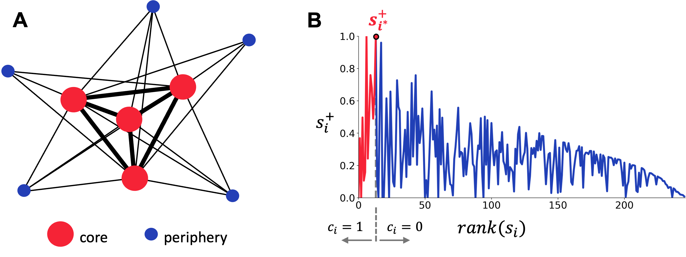

SYNESNET
---
This repository contains the code and supporting documents associated with the following manuscript:


<!-- Please cite as:

Hauw F. *, Gonzalez-Astudillo J. *, De Vico Fallani F., Cohen L. (2023). Increased core-periphery connectivity in ticker-tape synesthetes. ArXiv. -->

---
## Authors:
* Fabien Hauw , MD, PhD candidate, Sorbonne Université, AP-HP, Paris Brain Institute
* Juliana Gonzalez-Astudillo , Postdoctoral Researcher, Nerv team-project, Inria Paris, Paris Brain Institute
* Fabrizio De Vico Fallani, Research Director, Nerv team-project, Inria Paris, Paris Brain Institute
* Laurent Cohen, MD, PhD, PU-PH, Sorbonne Université, AP-HP, Paris Brain Institute


## Requirements
This repository contains the code used to run the analysis performed and to plot the figures.

- To install all the packages used in this work you can directly type in your terminal:
`pip install -r requirements.txt`
- Python 3.11 or more recent
- Verify local paths in `config.py`


### Coreness
This project's principal analysis relays on the computation of **coreness**. You can find its main implementation in `net_analysis.py`
```
from net.core import coreness
C, isCore = coreness(X)
```

Gaining insight into brain network organization is fundamental to bridge the gap between brain structure and function. 
The brain operates as a functional hierarchical system, where a select group of nodes act as a critical backbone or information processing core – a densely interconnected and topologically central subgraph. 
To assess this structure, we applied the concept of core-periphery, identifying core nodes characterized by their propensity to form denser connections among themselves than with other brain regions, from where they receive integrative information. 
Simultaneously, the remaining lower strength nodes make up the periphery (Fig. A). For quantifying this structural organization, we estimated the node coreness ($C_i$), the normalized number of thresholds at which the corresponding node is present in the rich core (1,2).

Considering a $N$-nodes network, we first compute the _richness_ as the node strength $s_i$, with $i=1,…,N$. 
Notice that this is the simplest way to define node richness, and other metrics such as node centrality measures, can also serve this purpose. 
Then we divide the links of each node $i$ in two groups, those towards nodes with lower richness ($s_i^-$) and those towards nodes with higher richness ($s_i^+$). 
Hence, we can specifically decompose the strength of node $i$ as

$s_i=s_i^-+s_i^+$.

Subsequently, the nodes are ranked in descending order of their richness. 
The node with the maximum $s_i^+$ within the rank finally determines the frontier between core and periphery (Fig. B). 



We repeat this procedure across an increasing full range of density thresholds ($\delta_n=n⁄(N-1)$ with $n=1, \ldots, n_{\delta_{\text{max}}}$). 
At each threshold, we retain a proportion of edges equivalent to $\delta_{\text{thr}}$ of the strongest weights. 
The last threshold is determined by the maximal $\delta_{\text{max}}$ observed in the native connectivity matrix, which are originally not fully connected. 
This results in a core-periphery matrix of zeros and ones (0: periphery, 1: core) with size $N \times n_{\delta_{\text{max}}}$ (`isCore`), where the row entries correspond to each of the nodes and the columns to the density thresholds. 
Finally, we obtained the coreness value by averaging each node across all the thresholds (`C`)

$C_i = \frac{1}{N} \sum_{\delta} c_i^\delta$.


1.	Ma A, Mondragón RJ. Rich-Cores in Networks. PLOS ONE. 2015 Mar 23;10(3):e0119678. 
2.	Battiston F, Guillon J, Chavez M, Latora V, De Vico Fallani F. Multiplex core-periphery organization of the human connectome. J R Soc Interface. 2018 Sep 12;15(146):20180514. 
